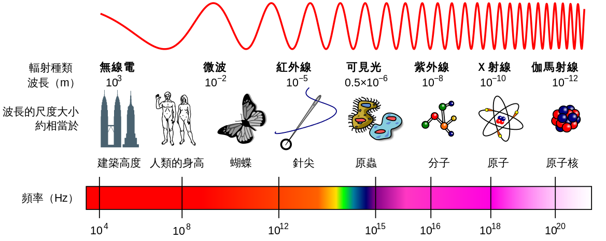

# 無線通訊課程第1期

## 名詞解釋
名詞(英文)         | 定義                            |備註
--------           | ------                         |-------
頻率(Frequency)     | 每秒通過的波的數量              |
振幅(Amplitude)     | 波震動的幅度                    |
波長(Wavelength)    | 一個波在一個震動週期所傳播的距離  |
赫茲(Hertz)         | 頻率的單位                      | (舉例: 1秒通過1個波為1Hz；通過100個為100Hz)
周期                | 一個波通過所花的時間，多以秒為單位| (舉例: 通過1個波要1秒即週期為1；要100秒即週期為100)
## 電磁波譜
日常生活中，從各種廣播用的訊號到陽光這些五顏六色的可見光到醫院使用的X光，大大小小都是光，也能稱為電磁波  
這些電磁波的差別在於頻率上的不同，將各種電磁波以頻率有左到右，由小到大排列所繪製成的便是"電磁波譜"(圖一)

